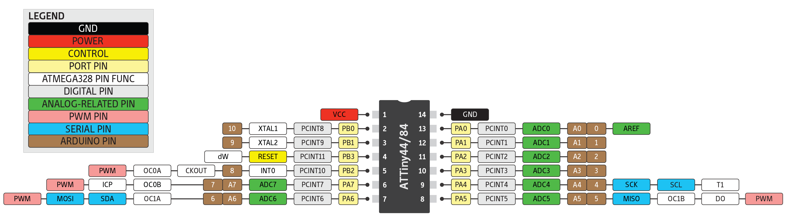

# Concrete LED Lamp

> A color-changing, concrete, LED lamp.


## Ingredients

* [ATtiny84](https://www.sparkfun.com/products/11232)
* [Triple Output High Power RGB LED](https://www.sparkfun.com/products/8718)
* [PicoBuck LED Driver](https://www.sparkfun.com/products/13705)

## Install

_NOTE: The makefile uses `avr-gcc` and `avrdude` to compile and upload. It also assumes you're using a `usbtiny` programmer, like the Sparkfun Pocket AVR Programmer._

1.  Connect your programmer

1.  Compile and upload

    ```
    $ make upload
    ```

## Resources

* [AVR Programming](https://github.com/cullylarson/avr-programming)
* [C Constants for ATMega328P](https://github.com/vancegroup-mirrors/avr-libc/blob/master/avr-libc/include/avr/iom328p.h)
* [ATtiny84 Datasheet](http://www.atmel.com/Images/doc8006.pdf)
* [Arduino C Code on Github](https://github.com/arduino/Arduino/tree/master/hardware/arduino/avr/cores/arduino)
* [Color Wheel for RGB LEDs](http://arcbotics.com/lessons/mixing-colors-with-the-rgb-led-2/)
* [PicoBuck Hookup Guide](https://learn.sparkfun.com/tutorials/picobuck-hookup-guide-v12)
* [Fastening a High Brightness LED to a Heat Sink Using Arctic Silver](https://www.youtube.com/watch?v=_XzTxie2Vgg) (VIDEO)

### Pin Layout


